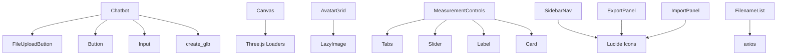

# BAMM Components Documentation

## Overview
This documentation covers all components in the BAMM (Body Avatar Motion Model) web application. The application is built using React, Next.js, and Three.js to create an interactive 3D avatar motion generation and visualization platform.

## Data Pipeline & Architecture

### Pipeline Overview
The BAMM application processes human motion data through a multi-stage pipeline that converts user inputs into animated 3D avatars:

```
USER INPUT → AI PROCESSING → MOTION DATA → 3D VISUALIZATION
```

### Detailed Data Flow

#### 1. **Input Stage**
**Data Sources:**
- **Text Prompts**: Natural language descriptions of motions (e.g., "person walking", "dancing")
- **Audio Files**: WAV/MP3 files for audio-driven motion generation
- **3D Models**: GLB files containing avatar meshes and skeletons
- **Motion Files**: BVH files with pre-recorded motion capture data

**Components:** `Chatbot.tsx`, `FileUploadButton.tsx`, `ImportPanel.tsx`

#### 2. **AI Processing Stage**
**Text-to-Motion Pipeline:**
```
Text Prompt → Motion Generation API → BVH Motion Data
└── API: https://handy-lamb-enough.ngrok.app/generate-motion
└── Parameters: motion_length, repeat_times, gpu_id, seed
└── Output: BVH filename for download
```

**Audio-to-Motion Pipeline:**
```
Audio File → Audio Motion API → BVH Motion Data
└── API: https://audio-motion.ngrok.app/generate-motion/
└── Input: FormData with WAV file
└── Output: BVH URL + Audio URL for synchronization
```

#### 3. **3D Model Generation**
**GLB Creation Pipeline:**
```
JSON Mesh Data → 3D Model Construction → GLB Export
├── vertices.json (3D coordinates)
├── faces.json (triangle indices)
├── joints.json (skeleton positions)
├── weights.json (skinning weights)
├── indices.json (bone assignments)
├── vt.json (UV coordinates)
└── mesh_albedo.png (texture)
```
**Component:** `create_glb.tsx`

#### 4. **Motion Retargeting**
**Skeleton Animation Pipeline:**
```
Source BVH → Target GLB → Retargeted Animation
├── Extract skeleton from BVH
├── Load target avatar from GLB
├── Map bone hierarchies (55-bone SMPL standard)
├── Retarget motion using SkeletonUtils
└── Apply hip normalization for ground alignment
```
**Component:** `Canvas.tsx` → `retargetModel()` function

#### 5. **3D Visualization**
**Rendering Pipeline:**
```
GLB Model + BVH Motion → Three.js Scene → WebGL Rendering
├── Load target model (/mesh/mesh.glb)
├── Apply skeletal animations
├── Position camera based on model size
├── Synchronize audio playback (if available)
└── Real-time 3D rendering with controls
```
**Components:** `Canvas.tsx`, `ThreeCanvas.tsx`

### Key Data Formats

| Format | Purpose | Structure | Usage |
|--------|---------|-----------|--------|
| **BVH** | Motion capture data | Hierarchical joint rotations + positions | Animation source |
| **GLB** | 3D models | Mesh + Skeleton + Textures | Avatar rendering |
| **JSON** | Mesh components | Vertices, faces, weights, UV coordinates | Model construction |
| **PNG** | Textures | Albedo maps for material rendering | Visual appearance |

### Data Storage & Management
- **Local Storage**: Audio files and preferences
- **Public Assets**: Static GLB models (`/assets/`, `/mesh/`)
- **API Endpoints**: Motion generation and file listing
- **Dynamic Content**: Generated BVH files and thumbnails

### Component Communication
```
Chatbot → Canvas (BVH filename)
FileUploadButton → Canvas (BVH + Audio URLs)
AvatarGrid → Canvas (Selected avatar)
MeasurementControls → Avatar (Body parameters)
SidebarNav → Layout (Panel switching)
```

## Motion Retargeting Deep Dive

### Overview
Motion retargeting is the core process that transfers skeletal animations from source BVH files to target GLB avatar models. This allows any motion capture data to be applied to any humanoid character, regardless of their original skeleton structure or proportions.

### Retargeting Pipeline

#### 1. **Source Motion Extraction**
```typescript
function getSource(sourceModel) {
  const clip = sourceModel.clip;                    // Animation clip data
  const helper = new THREE.SkeletonHelper(sourceModel.skeleton.bones[0]);
  const skeleton = new THREE.Skeleton(helper.bones); // Source skeleton
  const mixer = new THREE.AnimationMixer(sourceModel.skeleton.bones[0]);
  mixer.clipAction(sourceModel.clip).play();
  return { clip, skeleton, mixer };
}
```

**Process:**
- Extract animation clip from loaded BVH file
- Create skeleton helper for bone hierarchy
- Initialize animation mixer for playback control
- Return source animation components

#### 2. **Target Model Preparation**
```typescript
// Target model loading
const targetModel = await new Promise((resolve, reject) => {
  loader.load('/mesh/mesh.glb', resolve, undefined, reject);
});

// Skeleton binding
targetModel.scene.traverse((child) => {
  if (child.isSkinnedMesh) {
    child.skeleton.pose();           // Apply bind pose
    child.updateMatrixWorld(true);   // Update transformations
  }
});
```

**Process:**
- Load target GLB avatar model
- Apply bind pose to ensure proper initial positioning
- Update world transformation matrices

#### 3. **Skeleton Mapping & Retargeting**
```typescript
function retargetModel(source, targetModel) {
  const targetSkin = targetModel.scene.children[0];
  
  // Core retargeting using Three.js SkeletonUtils
  const retargetedClip = SkeletonUtils.retargetClip(
    targetSkin,        // Target skinned mesh
    source.skeleton,   // Source skeleton
    source.clip,       // Source animation clip
    {
      hip: 'Hips',     // Root bone mapping
      getBoneName: function (bone) {
        return bone.name;  // Bone name resolution
      }
    }
  );
  
  // Create animation mixer for target
  const mixer = new THREE.AnimationMixer(targetSkin);
  
  // Apply retargeted animation
  mixer.clipAction(retargetedClip).play();
  return mixer;
}
```

### Bone Mapping Strategy

#### SMPL Standard Compliance
The system uses a 55-bone humanoid skeleton following SMPL (Skinned Multi-Person Linear) standards:

**Core Body Hierarchy:**
```
Hips (Root)
├── LeftUpLeg → LeftLeg → LeftFoot → LeftToe
├── RightUpLeg → RightLeg → RightFoot → RightToe
└── Spine → Spine1 → Spine2 → Neck → Head
    ├── LeftShoulder → LeftArm → LeftForeArm → LeftHand
    └── RightShoulder → RightArm → RightForeArm → RightHand
```

**Detailed Bone Names:**
```typescript
const BONE_NAMES = [
  "Hips",                  // 0 - ROOT
  "LeftUpLeg",             // 1 - Left Thigh
  "RightUpLeg",            // 2 - Right Thigh
  "Spine",                 // 3 - Lower Spine
  // ... (55 total bones including fingers, eyes, jaw)
];

const PARENT_INDICES = [
  -1,   // 0  - Hips (root)
  0,    // 1  - LeftUpLeg (child of Hips)
  0,    // 2  - RightUpLeg (child of Hips)
  // ... (parent-child relationships)
];
```

### Hip Position Normalization

#### Problem
BVH files often contain absolute world positions that don't align with the target avatar's ground plane.

#### Solution
```typescript
// Hip position normalization in retargeted animation
retargetedClip.tracks.forEach((track) => {
  if (track.name.includes('Hips') && track.name.endsWith('.position')) {
    const values = track.values.slice(); // Clone values
    const firstY = values[1];             // First keyframe Y position
    
    // Center hips at ground level (y = 0)
    for (let i = 1; i < values.length; i += 3) {
      values[i] -= firstY; // Subtract initial Y offset
    }
    
    track.values = values;
  }
});
```

**Process:**
1. Identify hip position tracks in animation
2. Extract initial Y-position as offset
3. Subtract offset from all keyframes
4. Result: Character feet aligned with ground plane

### Retargeting Challenges & Solutions

#### 1. **Skeleton Proportion Differences**
**Challenge:** Source and target skeletons have different bone lengths
**Solution:** Three.js SkeletonUtils automatically scales rotations and positions based on bone length ratios

#### 2. **Bone Name Mapping**
**Challenge:** Different naming conventions between BVH and GLB files
**Solution:** `getBoneName` function provides flexible bone name resolution

#### 3. **Root Motion Handling**
**Challenge:** Preserving locomotion while adapting to new character size
**Solution:** Hip normalization maintains relative motion while ensuring ground contact

#### 4. **Animation Timing**
**Challenge:** Synchronizing with audio playback
**Solution:** Shared animation mixer with delta time updates

### Technical Implementation Details

#### Memory Management
```typescript
// Proper cleanup to prevent memory leaks
useEffect(() => {
  return () => {
    window.removeEventListener("resize", handleResize);
    canvasRef.current?.removeChild(renderer.domElement);
    renderer.dispose(); // Three.js resource cleanup
  };
}, [bvhFile, trigger]);
```

#### Animation Loop
```typescript
function animate() {
  const delta = clock.getDelta();
  if (mixer) mixer.update(delta);  // Update retargeted animation
  controls.update();               // Camera controls
  renderer.render(scene, camera);  // Render frame
}
renderer.setAnimationLoop(animate);
```

#### Camera Auto-Positioning
```typescript
// Automatic camera positioning based on model size
const box = new THREE.Box3().setFromObject(targetModel.scene);
const size = new THREE.Vector3();
box.getSize(size);

const modelHeight = size.y;
const distance = modelHeight * 2.2; // Zoom out based on height
camera.position.set(center.x - modelHeight * 0.5, modelHeight * 1.1, center.z + distance);
controls.target.set(center.x, modelHeight * 0.55, center.z); // Target chest height
```

### Performance Optimizations

1. **Skeleton Reuse**: Target skeleton is created once and reused
2. **Efficient Updates**: Only animation mixer updates during render loop
3. **Memory Cleanup**: Proper disposal of Three.js resources
4. **Lazy Loading**: BVH files loaded only when needed

### Debugging & Troubleshooting

#### Common Issues:
- **Misaligned Characters**: Check hip normalization values
- **Broken Animations**: Verify bone name mapping
- **Performance Issues**: Ensure proper Three.js resource disposal
- **Ground Penetration**: Adjust hip position offset calculation

#### Debug Helpers:
```typescript
// Uncomment for skeleton visualization
const skeletonHelper = new THREE.SkeletonHelper(sourceModel.skeleton.bones[0]);
scene.add(skeletonHelper);
```

This retargeting system enables seamless motion transfer between any humanoid characters while maintaining natural-looking animations and proper ground alignment.

## Table of Contents
1. [Main Components](#main-components)
2. [UI Components](#ui-components)
3. [Component Dependencies](#component-dependencies)
4. [Usage Examples](#usage-examples)

---

## Main Components

### 1. Chatbot.tsx
**Purpose**: Interactive chat interface for generating motion animations from text prompts

**Key Features**:
- Dynamic text field management (add/remove prompt fields)
- Integration with motion generation API
- File upload capability for audio files
- Loading states and error handling

**Props**:
```typescript
interface ChatbotProps {
  onFileReceived: (filename: string) => void;
  onSend: () => void;
  onAvatarUpdate: () => void;
}
```

**API Integration**:
- Sends POST requests to `https://handy-lamb-enough.ngrok.app/generate-motion`
- Supports text prompts, motion length, repeat times, and generation parameters
- Returns BVH filenames for motion visualization

**Dependencies**: Input, Button, FileUploadButton, create_glb, axios

---

### 2. ThreeCanvas.tsx
**Purpose**: 3D background scene with animated character showcase

**Key Features**:
- Rotating camera with orbit controls
- Character cycling (King, Venom, Human Torch models)
- Dynamic lighting setup (ambient, directional, spotlight)
- Neon stage environment
- Auto-rotation with user interaction detection

**Character Models**:
- King: `/assets/king.glb` (scale: 2.8, animation: "pl_king_face01_skill_b")
- Venom: `/assets/venom.glb` (scale: 2.0, animation: "103541_Shackle")
- Human Torch: `/assets/human_torch.glb` (scale: 3.2, animation: "HoverToFull")

**Scene Configuration**:
- Background color: `0x0a001a` (dark purple)
- Fog settings for depth perception
- Shadow mapping enabled
- 12-second character rotation cycle

**Dependencies**: Three.js, OrbitControls, GLTFLoader

---

### 3. Canvas.tsx
**Purpose**: Main 3D viewport for motion visualization and avatar animation

**Key Features**:
- BVH motion file loading and playback
- GLB avatar model rendering
- Skeletal animation retargeting
- Audio synchronization
- Camera auto-positioning based on model size

**Props**:
```typescript
interface CanvasProps {
  bvhFile: string | null;
  trigger?: boolean;
}
```

**Motion Pipeline**:
1. Load target GLB model (`/mesh/mesh.glb`)
2. Load source BVH motion data
3. Retarget skeleton animations using SkeletonUtils
4. Apply hip position normalization
5. Synchronize audio playback

**Key Functions**:
- `getSource()`: Extracts clip and skeleton from BVH
- `retargetModel()`: Maps BVH skeleton to GLB model
- Hip position centering for ground alignment

**Dependencies**: Three.js, BVHLoader, GLTFLoader, SkeletonUtils

---

### 4. FileUploadButton.tsx
**Purpose**: Audio file upload component with motion generation

**Key Features**:
- Audio file selection (accept: "audio/*")
- Loading states with animated spinner
- Fullscreen loading overlay
- Local audio storage for playback synchronization

**Props**:
```typescript
interface FileUploadProps {
  onFileReceived: (bvhPath: string, audioPath: string) => void;
}
```

**Workflow**:
1. User selects audio file
2. Creates FormData with WAV file
3. Sends to `https://audio-motion.ngrok.app/generate-motion/`
4. Stores local audio URL in localStorage
5. Returns BVH URL for animation

**Dependencies**: Button, Paperclip/Loader2 icons, axios

---

### 5. ImportPanel.tsx
**Purpose**: File import interface for GLB and BVH files

**Key Features**:
- Drag-and-drop style upload area
- File type validation (.glb, .bvh)
- Usage tips and format guidance
- 50MB file size limit

**File Support**:
- **GLB**: Avatar models with mesh and textures
- **BVH**: Motion capture data for animation

**UI Elements**:
- Upload cloud icon
- Hover effects for better UX
- File format specifications
- Import tips section

**Dependencies**: UploadCloud icon

---

### 6. AvatarGrid.tsx
**Purpose**: Grid display of available avatar thumbnails

**Key Features**:
- Lazy-loaded avatar thumbnails
- Selection state management
- API-driven file listing
- Responsive grid layout (2 columns)

**Props**:
```typescript
interface AvatarGridProps {
  onSelectAvatar: (filename: string) => void;
  className?: string;
}
```

**Data Flow**:
1. Fetches file list from `/api/listfile`
2. Renders LazyImage components for each avatar
3. Handles selection state with visual feedback
4. Triggers callback on avatar selection

**Dependencies**: LazyImage component

---

### 7. ExportPanel.tsx
**Purpose**: Export functionality for avatars and motion data

**Key Features**:
- Multiple export formats (GLB, USDZ, FBX, BVH)
- Format selection interface
- Export progress handling
- User feedback collection (5-star rating)

**Export Formats**:
- **GLB**: Standard 3D model format
- **USDZ**: Apple AR format for iPhones
- **FBX**: Autodesk format for professional tools
- **BVH**: Motion capture data format

**UI Features**:
- Grid format selection buttons
- Conditional export button enabling
- Help text for format recommendations
- Survey integration for UNC Charlotte AI4Health initiative

**Dependencies**: Download icon

---

### 8. SidebarNav.tsx
**Purpose**: Main navigation sidebar with panel switching

**Key Features**:
- Icon-based navigation
- Panel switching functionality
- Avatar preview
- Bottom-aligned settings and profile

**Navigation Panels**:
- **Avatars**: Character selection
- **Adjust**: Measurement controls
- **Import**: File upload
- **Export**: Download options
- **Settings**: Application settings
- **Profile**: User profile

**Props**:
```typescript
{ onSelect: (panel: string) => void }
```

**Dependencies**: Lucide icons (Settings, Sliders, Download, Upload, User)

---

### 9. LazyImage.tsx
**Purpose**: Performance-optimized image loading for avatar thumbnails

**Key Features**:
- Intersection Observer API for lazy loading
- Sprite sheet background positioning
- Loading state management
- Memory-efficient image handling

**Props**:
```typescript
interface Props {
  filename: string;
}
```

**Image Configuration**:
- Background image: `/vis/${filename}.png`
- Sprite sheet: 4x2 grid (400% x 200%)
- Position: Bottom-left tile (0% 100%)
- Fallback: Gray background color

**Performance Benefits**:
- Only loads images when visible
- Reduces initial page load time
- Automatic observer cleanup

---

### 10. create_glb.tsx
**Purpose**: GLB model creation and export utilities

**Key Features**:
- Procedural 3D model generation
- Skeletal animation binding
- Texture loading and application
- GLB export functionality

**Bone Structure**:
- 55-bone humanoid skeleton
- SMPL-compatible bone naming
- Hierarchical parent-child relationships
- Proper bone positioning and orientation

**Key Constants**:
- `BONE_NAMES`: Array of 55 bone names
- `PARENT_INDICES`: Skeletal hierarchy definition
- Bone naming follows SMPL standard

**Core Functions**:
- `calculateRelativePositions()`: Computes bone positions
- `createBones()`: Generates Three.js bone structure
- `loadModel()`: Main model loading function
- `exportToGLB()`: GLB file generation
- `loadTextureAsync()`: Texture loading utility

**Data Sources**:
- Vertices, faces, joints from JSON files
- Skeletal weights and indices
- UV coordinates for texture mapping
- Albedo textures for material rendering

**Dependencies**: Three.js, GLTFExporter, axios

---

### 11. MeasurementControls.tsx
**Purpose**: Avatar body measurement adjustment interface

**Key Features**:
- Slider-based measurement controls
- Real-time value updates
- Tabbed interface for different measurement categories
- Metric system (centimeters)

**Props**:
```typescript
interface MeasurementControlsProps {
  initialMeasurements?: Measurements;
  onChange?: (measurements: Measurements) => void;
}

interface Measurements {
  height: number;    // 50-200 cm
  inseam: number;    // 50-200 cm
  chest: number;     // 50-200 cm
  waist: number;     // 50-200 cm
  hips: number;      // 50-200 cm
}
```

**Default Values**:
- Height: 178 cm
- Inseam: 81 cm
- Chest: 106 cm
- Waist: 94 cm
- Hips: 104 cm

**User Interaction**:
- Live preview during slider drag
- Value commitment on release
- Visual feedback with current values

**Dependencies**: Tabs, Slider, Label, Card components

---

### 12. FilenameList.tsx
**Purpose**: Dropdown selector for available model files

**Key Features**:
- API-driven file list population
- Dropdown selection interface
- Selected state management
- File selection callbacks

**Props**:
```typescript
interface Props {
  onSelectFile: (filename: string) => void;
}
```

**Data Flow**:
1. Fetches from `/api/listfile` endpoint
2. Populates dropdown options
3. Handles selection changes
4. Triggers parent callback with filename

**UI Behavior**:
- Default placeholder text
- Full-width responsive design
- Text truncation for long filenames

**Dependencies**: axios

---

## UI Components

### 1. button.tsx
**Purpose**: Reusable button component with multiple variants and sizes

**Variants**:
- `default`: Primary button styling
- `destructive`: Red warning/danger buttons
- `outline`: Bordered buttons with transparent background
- `secondary`: Secondary action buttons
- `ghost`: Minimal buttons without background
- `link`: Text-only link-style buttons

**Sizes**:
- `default`: Standard button (h-10 px-4 py-2)
- `sm`: Small button (h-9 px-3)
- `lg`: Large button (h-11 px-8)
- `icon`: Square icon button (h-10 w-10)

**Features**:
- Radix UI Slot integration for polymorphic rendering
- Class Variance Authority (CVA) for variant management
- Focus management and accessibility
- Customizable through className prop

**Dependencies**: @radix-ui/react-slot, class-variance-authority

---

### 2. card.tsx
**Purpose**: Container components for grouped content

**Components**:
- `Card`: Base container with border and shadow
- `CardHeader`: Top section with padding
- `CardTitle`: Large title text
- `CardDescription`: Subtitle or description text
- `CardContent`: Main content area
- `CardFooter`: Bottom action area

**Styling**:
- Rounded corners with subtle shadows
- Consistent spacing and typography
- Flexible layout with proper semantic structure
- Theme-aware colors

---

### 3. input.tsx
**Purpose**: Styled text input component

**Features**:
- Consistent styling across the application
- Focus states with ring effects
- File input support
- Placeholder text styling
- Responsive font sizes (base on mobile, sm on desktop)
- Disabled state handling

**Accessibility**:
- Proper focus management
- Screen reader compatibility
- Keyboard navigation support

---

### 4. label.tsx
**Purpose**: Form label component with Radix UI integration

**Features**:
- Radix UI Label primitive wrapper
- Consistent typography (text-sm font-medium)
- Peer disabled state handling
- Accessibility improvements for form inputs

---

### 5. slider.tsx
**Purpose**: Range input slider component

**Features**:
- Radix UI Slider primitive
- Custom styling for track and thumb
- Focus and hover states
- Smooth dragging interaction
- Accessibility compliant

**Components**:
- Root container with touch support
- Track background
- Range indicator
- Draggable thumb with focus ring

---

### 6. tabs.tsx
**Purpose**: Tabbed interface components

**Components**:
- `Tabs`: Root container (direct Radix primitive)
- `TabsList`: Tab navigation container
- `TabsTrigger`: Individual tab buttons
- `TabsContent`: Tab panel content areas

**Features**:
- Keyboard navigation support
- Active state management
- Smooth transitions
- Consistent styling with hover/focus effects

---

## Component Dependencies

### External Libraries
- **React**: Core framework
- **Next.js**: Full-stack framework
- **Three.js**: 3D graphics and WebGL
- **@radix-ui**: Unstyled UI primitives
- **lucide-react**: Icon library
- **axios**: HTTP client
- **class-variance-authority**: Variant management

### Internal Dependencies


---

## Usage Examples

### Basic Component Usage

```tsx
// Chatbot with motion generation
<Chatbot 
  onFileReceived={(filename) => setBvhFile(filename)}
  onSend={() => setGenerating(true)}
  onAvatarUpdate={() => refreshAvatars()}
/>

// 3D Canvas with motion playback
<Canvas 
  bvhFile={currentBvhFile}
  trigger={generationComplete}
/>

// Avatar selection grid
<AvatarGrid 
  onSelectAvatar={(filename) => setSelectedAvatar(filename)}
  className="w-96"
/>

// Measurement controls
<MeasurementControls
  initialMeasurements={defaultMeasurements}
  onChange={(measurements) => updateAvatar(measurements)}
/>
```

### Layout Integration

```tsx
function MainLayout() {
  const [activePanel, setActivePanel] = useState("avatars");
  
  return (
    <div className="flex h-screen">
      <SidebarNav onSelect={setActivePanel} />
      
      {activePanel === "avatars" && <AvatarGrid />}
      {activePanel === "import" && <ImportPanel />}
      {activePanel === "export" && <ExportPanel />}
      {activePanel === "adjust" && <MeasurementControls />}
      
      <div className="flex-1">
        <Canvas bvhFile={currentMotion} />
        <Chatbot onFileReceived={setCurrentMotion} />
      </div>
    </div>
  );
}
```

---

## Architecture Notes

### Performance Considerations
- **LazyImage**: Implements intersection observer for optimal loading
- **Canvas**: Reuses Three.js instances and properly disposes resources
- **ThreeCanvas**: Efficient animation loops with requestAnimationFrame

### State Management
- Components use local state for UI interactions
- Parent-child communication through callback props
- localStorage for persistent settings (audio preferences)

### API Integration
- Motion generation: External ngrok tunnels for AI model inference
- File management: Internal Next.js API routes
- Error handling with graceful fallbacks

### Accessibility
- Proper ARIA labels and semantic HTML
- Keyboard navigation support
- Focus management for interactive elements
- Screen reader compatibility

---

## Development Guidelines

### Adding New Components
1. Follow the established props interface pattern
2. Include proper TypeScript definitions
3. Implement proper cleanup in useEffect hooks
4. Add to this documentation

### Performance Best Practices
1. Use React.memo for expensive components
2. Implement proper Three.js resource disposal
3. Optimize texture loading and caching
4. Use intersection observers for lazy loading

### Styling Guidelines
1. Use Tailwind CSS utility classes
2. Maintain consistent spacing and typography
3. Follow the established color scheme
4. Ensure responsive design principles

---

*This documentation covers the complete component structure of the BAMM web application. For implementation details, refer to the individual component files and their inline comments.* 