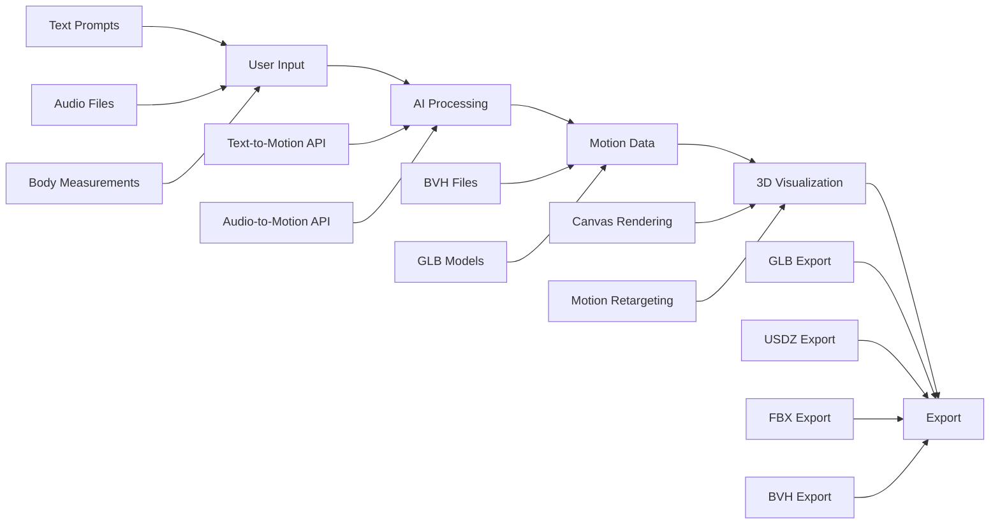
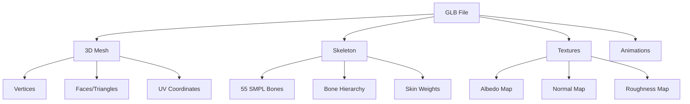
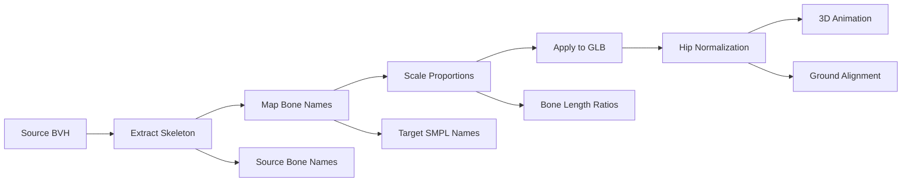

# BAMM - Body Avatar Motion Model

## 🚀 Overview

**BAMM (Body Avatar Motion Model)** is an advanced web application that transforms natural language descriptions and audio inputs into realistic 3D character animations. Using cutting-edge AI and computer graphics technologies, BAMM enables users to create, visualize, and export custom animated avatars through an intuitive interface.

### ✨ Key Features
- **Text-to-Motion Generation**: Convert natural language into realistic animations
- **Audio-to-Motion Synthesis**: Generate dance and gesture animations from audio files
- **3D Avatar Customization**: Create personalized characters with adjustable body measurements
- **Real-time 3D Visualization**: Interactive 3D viewport with camera controls
- **Motion Retargeting**: Apply any animation to any humanoid character
- **Multi-format Export**: Export animations in GLB, USDZ, FBX, and BVH formats

---

## 🔄 Data Pipeline & Architecture

### High-Level Pipeline


### Detailed Data Flow

#### 1. **Input Stage** 📥
**Data Sources:**
- **Text Prompts**: Natural language descriptions ("person walking", "dancing salsa")
- **Audio Files**: WAV/MP3 files for rhythm-based motion generation
- **Body Measurements**: Height, chest, waist, hip, inseam measurements
- **Avatar Selection**: Pre-built character models

#### 2. **AI Processing Stage** 🤖
**Text-to-Motion Pipeline:**
```
Text Description → Motion Generation API → BVH Animation Data
                ↓
"person walking quickly" → AI Model → walking_motion_001.bvh
```

**Audio-to-Motion Pipeline:**
```
Audio File (WAV/MP3) → Audio Analysis → Synchronized BVH + Audio
                    ↓
music.mp3 → Beat Detection + Movement AI → dance_motion_sync.bvh
```

#### 3. **3D Model Generation** 🎨
**Avatar Creation Process:**
```
User Measurements → SMPL Body Model → 3D Mesh Generation → GLB Export
     ↓                    ↓                 ↓              ↓
Height: 175cm         Body Shape        vertices.json    avatar.glb
Chest: 100cm    →    Proportions   →   faces.json   →   + textures
Waist: 80cm          Skeleton          weights.json     + skeleton
```

#### 4. **Motion Retargeting** 🎭
**Animation Transfer Process:**
```
Source BVH → Skeleton Mapping → Target GLB → Retargeted Animation
     ↓             ↓               ↓              ↓
Motion Data → SMPL Bone Names → Avatar Model → Live Animation
```

#### 5. **3D Visualization & Export** 🎬
**Rendering Pipeline:**
```
GLB Model + BVH Motion → Three.js Scene → WebGL Rendering → Export Options
        ↓                     ↓              ↓              ↓
    Character            3D Environment    Real-time       GLB/USDZ/FBX
    + Animation          + Lighting        Display         Downloads
```

---

## 📁 File Formats & Data Structures

### Core File Types

| Format | Purpose | Structure | Usage |
|--------|---------|-----------|--------|
| **BVH** | Motion capture data | Hierarchical joint rotations + positions | Animation source |
| **GLB** | 3D models | Mesh + Skeleton + Textures (binary glTF) | Avatar rendering |
| **JSON** | Mesh components | Vertices, faces, weights, UV coordinates | Model construction |
| **PNG/JPG** | Textures | Albedo, normal, roughness maps | Visual appearance |

### BVH (Biovision Hierarchy) Structure
```
HIERARCHY                    # Skeleton definition
ROOT Hips                   # Root bone (pelvis)
├── JOINT LeftUpLeg         # Left thigh
│   └── JOINT LeftLeg       # Left shin
│       └── JOINT LeftFoot  # Left foot
├── JOINT RightUpLeg        # Right thigh
└── JOINT Spine             # Torso
    └── JOINT Neck          # Neck
        └── JOINT Head      # Head

MOTION                      # Animation data
Frames: 300                 # Number of keyframes
Frame Time: 0.033333        # 30 FPS
[rotation data...]          # Per-frame joint rotations
```

### GLB Model Components


---

## 🦴 SMPL Skeleton System

### Bone Hierarchy (55 Bones)
```
                    Head (15)
                      |
                   Neck (12)
                      |
    LeftEye(23)   Spine2 (9)   RightEye(24)
                      |
           LeftShoulder(13) -- Spine1 (6) -- RightShoulder(14)
                |                |                |
           LeftArm(16)        Spine (3)      RightArm(17)
                |                |                |
        LeftForeArm(18)      Hips (0)       RightForeArm(19)
                |           /        \            |
          LeftHand(20)     /          \     RightHand(21)
                      LeftUpLeg(1)  RightUpLeg(2)
                          |              |
                      LeftLeg(4)     RightLeg(5)
                          |              |
                     LeftFoot(7)    RightFoot(8)
                          |              |
                     LeftToe(10)    RightToe(11)
```

### Bone Naming Convention
- **Root**: `Hips` (pelvis, center of mass)
- **Limbs**: `Left/Right + UpLeg/Leg/Foot` (legs), `Left/Right + Arm/ForeArm/Hand` (arms)
- **Spine**: `Spine`, `Spine1`, `Spine2` (lower to upper back)
- **Head**: `Neck`, `Head`, `LeftEye`, `RightEye`, `Jaw`
- **Fingers**: 30 finger bones (5 per finger × 3 joints × 2 hands)

### Motion Retargeting Process


---

## 🛠️ Technology Stack

### Frontend
- **React 18**: Component framework with hooks
- **Next.js 13**: Full-stack framework with app router
- **TypeScript**: Type-safe development
- **Tailwind CSS**: Utility-first styling
- **Three.js**: 3D graphics and WebGL rendering

### 3D Graphics
- **Three.js Loaders**: BVHLoader, GLTFLoader for file parsing
- **SkeletonUtils**: Motion retargeting and bone mapping
- **Animation System**: Mixers, clips, and keyframe interpolation
- **WebGL**: Hardware-accelerated 3D rendering

### UI Components
- **Radix UI**: Accessible, unstyled UI primitives
- **Lucide React**: Modern icon library
- **Class Variance Authority**: Component variant management

### APIs & Services
- **Motion Generation**: `https://handy-lamb-enough.ngrok.app/generate-motion`
- **Audio-to-Motion**: `https://audio-motion.ngrok.app/generate-motion/`
- **File Management**: Internal Next.js API routes

---

## 🎯 User Workflow

### 1. **Create Motion** 📝
```
User enters text prompt → "person doing jumping jacks"
                      ↓
AI processes request → Motion generation API
                      ↓
BVH file generated → jumping_jacks_motion.bvh
```

### 2. **Select/Create Avatar** 👤
```
Choose existing avatar → Browse avatar grid
            OR
Create custom avatar → Adjust body measurements
                    ↓
GLB model ready → Personalized character
```

### 3. **Apply Animation** 🎭
```
BVH motion + GLB avatar → Motion retargeting system
                        ↓
Skeleton mapping → SMPL bone alignment
                        ↓
Live 3D animation → Character performing jumping jacks
```

### 4. **Export & Use** 📦
```
Choose export format → GLB (web), USDZ (iOS AR), FBX (professional)
                    ↓
Download file → Import into other applications
```

---

## 🎨 Application Interface

### Main Components
- **Chatbot Interface**: Text prompt input and motion generation
- **3D Canvas**: Real-time character animation viewport
- **Avatar Grid**: Character selection and customization
- **Control Panels**: Import, export, measurement adjustment
- **Navigation**: Sidebar with panel switching

### 3D Viewport Features
- **Orbit Controls**: Mouse/touch camera manipulation
- **Auto-framing**: Camera automatically positions based on character size
- **Lighting**: Professional 3-point lighting setup
- **Audio Sync**: Animation synchronized with uploaded audio
- **Performance**: Optimized for 60fps real-time rendering

---

## 🔬 Motion Retargeting Deep Dive

### Challenge
Different characters have different:
- **Bone lengths** (tall vs. short characters)
- **Proportions** (arm/leg ratios)
- **Skeleton naming** (different bone name conventions)

### Solution: SMPL Standard
- **Standardized naming**: Consistent bone names across all models
- **Proportional scaling**: Automatic bone length ratio calculations
- **Hip normalization**: Ensures feet stay on ground regardless of character height

### Mathematical Process
```
Source Motion → Target Character
     ↓               ↓
BVH rotations → Scale by bone length ratios → GLB rotations
BVH positions → Adjust for character height → GLB positions
```

---

## 🚀 Getting Started

### Prerequisites
- Node.js 18+
- Modern web browser with WebGL support
- Internet connection for AI motion generation APIs

### Installation
```bash
git clone https://github.com/your-repo/bamm-wa
cd bamm-wa
npm install
npm run dev
```

### Basic Usage
1. **Open application** in web browser
2. **Enter text prompt** describing desired motion
3. **Click "Generate"** to create BVH animation
4. **Select avatar** from grid or create custom character
5. **View animation** in 3D viewport
6. **Export** in desired format (GLB, USDZ, FBX, BVH)

---

## 📈 Performance & Optimization

### Rendering Optimizations
- **Lazy loading**: Assets loaded only when needed
- **Memory management**: Proper Three.js resource disposal
- **Animation efficiency**: Optimized bone matrix calculations
- **LOD system**: Level-of-detail for complex models

### Network Optimizations
- **Asset caching**: Local storage for frequently used files
- **Progressive loading**: Streaming for large models
- **API optimization**: Efficient motion generation requests

---

## 🔮 Future Enhancements

### Planned Features
- **Real-time collaboration**: Multi-user motion editing
- **Advanced physics**: Cloth simulation and soft-body dynamics
- **Facial animation**: Expression generation from audio
- **Motion blending**: Smooth transitions between animations
- **VR/AR support**: Immersive character interaction

### Research Directions
- **Neural motion synthesis**: Advanced AI motion generation
- **Style transfer**: Personality-based animation adaptation
- **Procedural animation**: Rule-based motion systems

---

## 📄 License

MIT License - See [LICENSE](LICENSE) file for details.

## 🙏 Acknowledgments

- **SMPL Model**: Max Planck Institute for Intelligent Systems
- **Three.js Community**: 3D web graphics framework
- **Motion Capture Data**: Various mocap databases and contributors

---

*BAMM empowers creators to bring their imagination to life through AI-powered motion generation and 3D character animation.* 